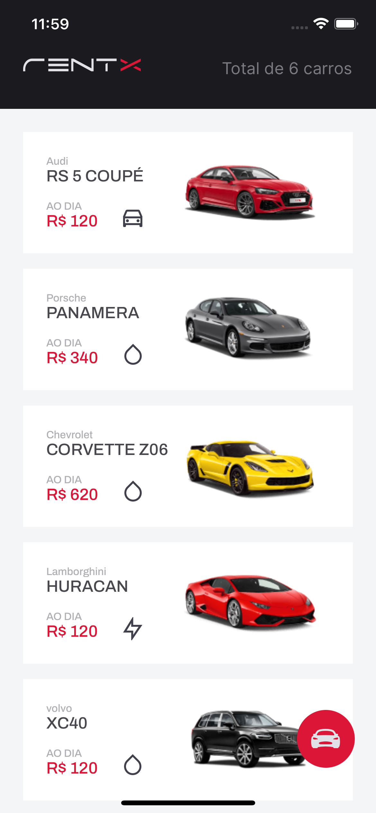

   

  

  

  

 

## 💡 Introduction

Car rent application with React Native

1. Choose a car to rent
2. View car information
3. Pick a period to rent a car
4. View all your rented cars

 

## 🧪 Technologies

Technologies that were used on this application:

- [React](https://reactjs.org)
- [React Native](https://reactnative.dev/)
- [Expo](https://expo.dev/)

 

## 🔖 Layout

Check Figma Layout of this project [here](https://www.figma.com/file/4ojyGi2mGuQaGK0sUHMAqB/RentX-Ignite?node-id=0%3A1)

 

## 📝 License

MIT License © Yuri Paiva. Check [LICENSE](LICENSE) for more details

 

Made with 💜 &nbsp;by Yuri Paiva
